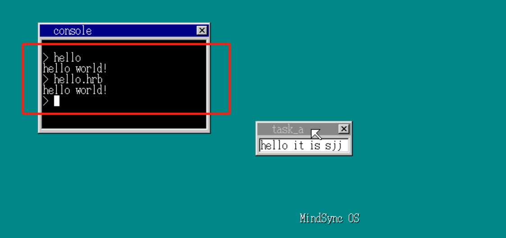

# 实验二（操作系统大作业）

- 选题：《自制OS实验》

## 个人信息

- 姓名：苏俊杰
- 学号：2022211607
- 班级：2022211807

## 摘要

- “开发一个操作系统”，听起来是一个不简单的事情，事实上也不简单，可也并没有我们想的那么难。笔者本事只是有点兴趣，想要尝试一下，意外地发现其实起步并没有那么困难，只是需要一点时间去熟悉OS。不知不觉中，小小的尝试也产出了成果，而且仍有继续成长的趋势，说白了，容易上瘾。
- 本文将介绍笔者开发的一个微型系统，名为 `MindSync OS`，意为善解人意的系统，中文名还没想好。为什么要起这个名字？这是笔者起初的遐想，希望能开发一个便于用户管理文件和阅读的OS，现在看来确实是止于遐想了哈哈，毕竟当时还没着手写代码，只是跟着教程，听大牛们说在开发OS前一定要对OS有一些理想，或者说叫系统哲学？于是就起了这个名字。还像具体了解这个名字的含义的话，可以到 `MindSync OS`项目仓库的 `README.md`查看。
- `MindSync OS`虽然只是一个非常小的微型系统，但已经具有了比较完整的功能体系，能够覆盖操作系统的五个基本问题：处理机管理、存储器管理、设备管理、文件管理、OS与用户接口。虽然每个部分的实现都不是最优解，不如说优化比较差，但至少在功能上解决了问题，是可用的。而且系统大小不过几十k，还能够覆盖到这五个问题，笔者认为这就足够了。
- `MindSync OS`的整个所有项目文件已经上传到Github上，如果希望测试这个系统，请点击：[MindSync OS](https://github.com/Momoyeyu/MindSyncOS)。

## 第一章：系统概述

- `MindSync OS`（下称“本系统”）是一款微型的操作系统，具有绝大部分现代操作系统所需的基本功能，也支持许多让人兴奋的功能，比如支持多任务，具有图形化界面等等。本章将会简要介绍本系统的基本信息，列举本系统的功能，并说明本系统如何进行使用和测试。

### 1.1 系统信息概述

- 本系统在开发过程中使用的是Windows 11系统，并通过qemu将本系统作为虚拟机启动进行测试。此处引用主要参考文献的原话：
  - 本文的一切说明也将面向以IBM PC/AT兼容机（也就是所谓的Windows个人电脑）为对象进行说明。至于其他机型，比如Mac（苹果），虽然也参考了其中某些部分，但基本上无法开发出在这些机型上运行的操作系统，这一点还请见谅。严格地说，不是所有能称为AT兼容机的机型都可以开发我们这个操作系统，我们对机器的配置要求是CPU高于386（因为我们要开发32位操作系统）。换句话说，只要是能运行Windows 95以上操作系统的机器就没有问题，况且现在市面上（包括二手市场）恐怕都很难找到Windows 95以下的机器了，所以我们现在用的机型一般都没问题。
- 简单地说，就是本系统的在编写的时候面向的是特定的指令集，而且使用的编译软件也依赖特定的操作系统，而且Makefile也是依赖于命令行工具所支持的指令的，具体的说明请见1.3节。

### 1.2 系统功能概述

- 本节将简单列举系统具有的功能。

1. 处理机管理：
   1. 系统支持多任务并发运行，设置任务优先级，高优先级优先运行，同级任务按时间片轮转法调度。
   2. 系统支持绝大多数任务调度原语，能够将任务在创建、就绪、运行、阻塞、挂起、终止几个状态合理切换。
   3. 通过FIFO实现消息队列对任务进行控制，配合开关中断，支持任务的互斥与同步。
2. 存储器管理：
   1. 系统支持动态内存分配与释放，使用首次适应算法，且对内核与用户区域进行了设计与划分。
   2. 系统控制台支持使用 `mem`指令查看内存使用情况。
3. 设备管理：
   1. 系统支持键盘与鼠标控制，编写中断处理程序处理用户输入。
   2. 能够使用键盘输入文字，使用 `Tab`切换窗口，使用鼠标移动窗口。
4. 文件管理：
   1. 系统控制台支持使用 `dir`指令查看磁盘目录，使用 `type`指令查看文件内容。
   2. 支持检索并运行存储在系统硬盘的用户程序，系统内有一个示例程序 `hello.hrb`，可以输入 `hello`或 `hello.hrb`运行。
5. OS与用户接口：
   1. 系统具有可视界面，以窗口形式显示应用程序画面，支持多图层的叠加处理。
   2. 用户可以使用鼠标与系统交互。
   3. 用户可以使用键盘输入指令，并在屏幕现实的控制台查看回显。
   4. 用户可以使用系统提供的API进行编程，实现用户程序在控制台输出文字。

### 1.3 系统使用说明

1. 本系统的在开发的时候面向的是特定的指令集（x86），所有使用汇编语言实现的部分都是按照x86的规格进行编写，因此需要在x86架构的机器上使用nasm等工具编译成2进制才可以运行。本系统比较特殊，使用了一种名为nask的汇编编译器，是主要哦参考资料的作者提供的。
2. 本系统使用的编译软件也依赖特定的操作系统，仓库中所有的依赖软件都是.exe的二进制文件，即Windows系统的可执行文件，所以想要直接使用只能在Windows上运行。
3. Makefile使用了Bash shell指令，因此理论上只能使用git bash运行，其他命令行无法保证能够正常运行。事实上，笔者自己就尝试在Windows命令行（cmd）和Powershell使用对应的指令编写Makefile，但出现了各种bug，只有git bash得以正常运行，因此，强烈建议直接使用git bash运行笔者写好的Makefile，如果非要自己改用其他命令行，请自行研究如何运行。

- 综上所述，如果想要开箱即用，就要使用符合此处说明的环境进行测试：
  - 请在裸机使用软盘启动，或在 `Windows`系统使用 `qemu`运行此项目，暂不支持其他启动方式。
  - 理论上，映像文件可以直接在裸机运行，但仍建议在 `qemu`进行运行。裸机运行出现任何问题，后果自负。
  - 请在拉取仓库后，打开命令行，进入 `src`目录，输入 `make run`即可运行操作系统。
  - 请使用 `git bash`命令行工具，否则可能会出现错误。
  - 如果修改代码后 `make run`出现错误，可以尝试 `make clean`清除中间文件后再次 `make run`。
  - 可以使用`ctrl + alt`将控制权退出到`qemu`外部。

## 第二章：系统设计

### 2.1 系统流程图

#### 2.1.1 系统主进程

- 如图，系统主进程进行了初始化操作，让本系统真正启动起来，之后进入了一个循环，反复检测用户的输入产生的信号，并针对不同的信号调用不同的模块进行响应。
- 值得一提的是，此处不同的黄色模块之间是支持并发处理的，绿色的则是主进程本身的操作，绿色块之间是不存在并发的，但是可以与黄色的子模块并发，因为这些黄色的模块属于独立的进程。
  

#### 2.1.2 其他模块

- 下图则展示了本系统主进程提到的几个重要模块及其子模块。其中，键盘处理进程会首先处理用户的输入，根据输入的信号类型决定转发给什么子进程，其中最重要的一个就是控制台进程。
- 控制台进程则是可以显示用户输入的各种字符，并在用户按下回车时执行指令，指令有些是内置在指令执行模块的，类似Linux的shell指令，其他则是一些用户编写的程序，本次实验只编写了一个hello程序用于显示“hello world！”测试指令执行模块的有效性。
- 鼠标处理则是为了方便用户控制系统，不过由于时间优先，点击事件还几乎没有编写，就得急着先写报告之后准备期末了，重要的功能以后一定会补上的。


### 2.2 系统功能模块
- 下图展示了本系统的主要功能模块。具体的单个功能由于数量较多，不便于在图中展示，详情请移步第三章，或查看项目源码。
- 图中第二层展示了系统目前所有的功能模块，其中有两个模块由于功能需要进一步分类，划分出了子模块。每一个模块或子模块都对应源码中的一个文件。


### 2.3 系统内存分布图
- 为了保证内存不会出现冲突，本系统对内存区域进行了划分，保证每个功能模块能使用不同的分区，避免内存覆盖。
|          地址           |                      作用                      |     大小      |
| :---------------------: | :--------------------------------------------: | :-----------: |
| 0x00000000 - 0x000fffff | 启动时使用，之后基本会清空（除了BIOS和vram等） |      1MB      |
| 0x00100000 - 0x00267fff |          用于保存软盘的内容（文件等）          |    1440KB     |
| 0x00268000 - 0x0026f7ff |          暂时为空，可用于临时存储参数          |     30KB      |
| 0x0026f800 - 0x0026ffff |                      IDT                       |      2KB      |
| 0x00270000 - 0x0027ffff |                      GDT                       |     64KB      |
| 0x00280000 - 0x002fffff |                  bootpack.hrb                  |     512KB     |
| 0x00300000 - 0x003fffff |                    栈及其他                    |      1MB      |
|  0x00400000 - \${end}   |                 空，供后续使用                 | \${ALL} - 4MB |
## 第三章：系统代码简析

### 3.1 处理机管理

1. 本系统实现了基本的任务调度，并实现了任务调度原语操作，包括：
   - `task_alloc()`：实现任务创建
   - `task_add()`：将任务加入就绪队列
   - `task_switch()`：将运行的任务终止，激活队列中的下一个任务
   - `task_sleep()`：将任务挂起
   - `task_run()`：激活挂起任务
   - `task_remove()`：任务释放
- 部分原语函数定义如下
```c
struct TASK *task_alloc(void);                             // 任务创建
void task_add(struct TASK *task);                          // 任务就绪
void task_switch(void);                                    // 时间片完&任务调度
void task_sleep(struct TASK *task);                        // 任务挂起
void task_run(struct TASK *task, int level, int priority); // 任务激活
void task_remove(struct TASK *task);                       // 任务释放
```
- 其中，任务阻塞将通过其他中断程序实现，此处不一一列举。
- 通过这些原语，可以实现任务在创建、就绪、执行、阻塞、挂起、阻塞、挂起之间灵活变换。

2. 本系统使用多级队列调度算法，建立了以下几个重要的数据结构：
```c
struct TSS32
{
    int backlink, esp0, ss0, esp1, ss1, esp2, ss2, cr3;
    int eip, eflags, eax, ecx, edx, ebx, esp, ebp, esi, edi;
    int es, cs, ss, ds, fs, gs;
    int ldtr, iomap;
};
struct TASK
{
    int sel, flags; // sel用来存放GDT的编号
    int level, priority;
    struct FIFO32 fifo;
    struct TSS32 tss;
};
struct TASKLEVEL
{
    int running; // 正在运行的任务数量
    int now;     // 这个变量用来记录当前正在运行的是哪个任务
    struct TASK *tasks[MAX_TASKS_LV];
};
struct TASKCTL
{
    int now_lv;     // 现在活动中的LEVEL
    char lv_change; // 在下次任务切换时是否需要改变LEVEL
    struct TASKLEVEL level[MAX_TASKLEVELS];
    struct TASK tasks0[MAX_TASKS];
};
```
- 配合任务调动原语，本系统实现了多任务并发。

### 3.2 存储器管理
1. 为实现动态内存分配，本系统实现了以下内存管理函数：
  - `memman_init()`：初始化内存管理器
  - `memman_total()`：获取内存总大小
  - `memman_alloc()`：分配内存
  - `memman_free()`：释放内存
  - `memman_alloc_4k()`：以4k字节为单位分配内存
  - `memman_free_4k()`：以4k字节为单位释放内存
```c
void memman_init(struct MEMMAN *manager);
unsigned int memman_total(struct MEMMAN *manager);
unsigned int memman_alloc(struct MEMMAN *manager, unsigned int size);
int memman_free(struct MEMMAN *manager, unsigned int addr, unsigned int size);
unsigned int memman_alloc_4k(struct MEMMAN *manager, unsigned int size);
int memman_free_4k(struct MEMMAN *manager, unsigned int addr, unsigned int size);
```
2. 为管理内存，本系统按照预先设计好的内存分布图设计了以下数据结构：
```c
struct FREEINFO
{ /* 可用信息 */
    unsigned int addr, size;
};
struct MEMMAN
{ /* 内存管理 */
    int frees, maxfrees, lostsize, losts;
    struct FREEINFO free[MEMMAN_FREES];
};
```
- 其中，FREEINFO是可用内存的表示结点，MEMMAN则是Memory Manager的简称，存储了系统内存分配状态。

### 3.3 设备管理
1. 为了实现对外设的管理，系统实现了以下函数：
   - `enable_mouse()`：鼠标初始化
   - `mouse_decode()`：鼠标驱动
   - `inthandler2c()`：鼠标中断处理程序
   - `init_keyboard()`：键盘初始化
   - `wait_KBC_sendready()`：与设备无关的I/O程序
   - `inthandler21()`：键盘中断处理程序
```c
/* mouse.c */
void enable_mouse(struct FIFO32 *fifo, int data0, struct MOUSE_DEC *mdec);
int mouse_decode(struct MOUSE_DEC *mdec, unsigned char dat);
void inthandler2c(int *esp);
/* keyboard.c */
void init_keyboard(struct FIFO32 *fifo, int data0);
void wait_KBC_sendready(void);
void inthandler21(int *esp);
```
- 值得一提的是，最底层的I/O调度是通过汇编语言实现的，具体可以查看`naskfunc.nas`文件。

2. 为了记录外设的状态，设置了以下重要数据结构：
```c
struct MOUSE_DEC
{
    unsigned char buf[3], phase;
    int x, y, btn;
};
```

3. 为实现对用户输入信号的缓冲与分发，实现了FIFO模块，具有以下功能：
   - `fifo32_init()`：初始化一个FIFO
   - `fifo32_put()`：向FIFO中压入一个数据
   - `fifo32_get()`：从FIFO取出一个数据
   - `fifo32_status()`：返回FIFO已经使用的空间大小
```c
struct FIFO32
{
    int *buf;
    int p, q, size, free, flags;
    struct TASK *task;
};
void fifo32_init(struct FIFO32 *fifo, int size, int *buf, struct TASK *task);
int fifo32_put(struct FIFO32 *fifo, int data);
int fifo32_get(struct FIFO32 *fifo);
int fifo32_status(struct FIFO32 *fifo);
```

### 3.4 文件管理
- 本系统对文件管理的部分还没有较好的完成，目前只是在系统编译时将一些文件写入映像文件中。
  - `file_loadfile()`：为方便其他模块获取文件地址，支持使用文件名获取文件地址。
  - `file_readfat()`：读取FAT文件，使文件不在连续分区的时候可以正确的被读取。
```c
struct FILEINFO
{
    unsigned char name[8], ext[3], type;
    char reserve[10];
    unsigned short time, date, clustno;
    unsigned int size;
};
void file_loadfile(int clustno, int size, char *buf, int *fat, char *img);
void file_readfat(int *fat, unsigned char *img);
```
- 关于文件管理本事，目前仅支持：
  - 使用`dir`指令查看目录。
  - 使用`type`指令加上文件名为参数查看文件内容。

### 3.5 OS与用户接口
1. 为让用户使用图形化界面与本系统交互，本系统支持窗口与多图层显示：
   - `boxfill8()`：初始化屏幕背景。
   - `putfonts8_asc()`：输出文字。
   - `init_mouse_cursor8()`：显示鼠标。
   - `putblock8()`：渲染一块指定的显存。
   - `make_textbox8()`：在指定图层生成一个小窗口。
   - `make_window8()`：在指定图层生成控制台窗口。
   - `make_wtitle8()`：指定窗口的名称。
   - `putfonts8_asc_sht()`：在指定图层的指定位置输出文字。
```c
/* graphic.c */
void boxfill8(unsigned char *vram, int xsize, unsigned char c, int x0, int y0, int x1, int y1);
void putfonts8_asc(char *vram, int xsize, int x, int y, char c, char *s);
void init_mouse_cursor8(char *mouse, char bc);
void putblock8(char *vram, int xsize, int x, int y, char *buf, int width, int height);
/* window.c */
void make_textbox8(struct SHEET *sht, int x0, int y0, int sx, int sy, int c);
void make_window8(unsigned char *buf, int xsize, int ysize, char *title, char act);
void make_wtitle8(unsigned char *buf, int xsize, char *title, char act);
void putfonts8_asc_sht(struct SHEET *sht, int x0, int y0, int c, int bc, char *s, int l);
```

2. 为了与用户进行交互，本系统支持键盘输入回显，可以在控制台或者其他窗口显示用户输入的文字，此处以控制台为例：
   - `cons_newline()`：实现控制台显示换行。
   - `cons_putchar()`：实现控制台输出一个字符（横向超出会自动换行）。
   - `cons_putstr0()`：实现输出一个完整的字符串（横向超出会自动换行）。
   - `cons_putstr1()`：实现输出一个字符串前指定数量的字符（横向超出会自动换行）。
```c
void cons_newline(struct CONSOLE *cons);
void cons_putchar(struct CONSOLE *cons, int chr, char move);
void cons_putstr0(struct CONSOLE *cons, char *s);
void cons_putstr1(struct CONSOLE *cons, const char *s, int l);
```
3. 为了用户能够操作本系统，本系统提供了一些指令以及运行用户程序的功能：
   - `cons_runcmd()`：负责执行系统指令、运行用户程序。
   - `cmd_mem()`：实现了`mem`指令，显示系统内存状态。
   - `cmd_cls()`：实现了`cls`指令，清空控制台。
   - `cmd_dir()`：实现了`dir`指令，显示系统目录。
   - `cmd_type()`：实现了`type`指令，类似Linux的`cat`指令，查看文件内容。
   - `cmd_app()`：用于执行用户程序，执行任何存储在系统中的`.hrb`二进制文件。
```c
void cons_runcmd(char *cmdline, struct CONSOLE *cons, int *fat, unsigned int memtotal);
void cmd_mem(struct CONSOLE *cons, unsigned int memtotal);
void cmd_cls(struct CONSOLE *cons);
void cmd_dir(struct CONSOLE *cons);
void cmd_type(struct CONSOLE *cons, int *fat, char *cmdline);
int cmd_app(struct CONSOLE *cons, int *fat, char *cmdline);
```

4. 为了用户可以在本系统上开发用户程序，本系统提供了少许API：
   - `asm_cons_putchar()`：系统的字符输出API，需要在`bootpack.map`文件中找到函数地址才可以调用，比较麻烦。
   - `asm_hrb_api()`：为方便用户使用，将API统一在此函数，并通过将实际的API注册到IDT，让用户使用系统中断来调用API，比较方便。
```c
/* naskfunc.nas */
void asm_cons_putchar();
void asm_hrb_api();
```

### 3.6 其他
- 处理刚才提到的解决五个主要问题的部分，还有重要的部分需要提一下：
  - 汇编部分：实现了C语言无法实现的针对寄存器的操作，在许多模块中都有调用。
  - GDT&IDT&PIC：程序分段、中断的重要实现部分，许多模块使用了系统中断，程序段要注册在GDT，中断程序要注册IDT，这些代码是绝大部分模块的基础。
  - 计时器：计时器为同级任务时间片轮转法切换任务提供了服务，也为画面显示等其他中断处理提供了服务。

## 第四章：系统效果展示
- 本次在Windows终端使用qemu进行系统效果展示。

### 4.1 系统启动
- 如图，进入系统src目录，使用`make run`指令编译并运行操作系统（其他的make指令可以在Makefile查看）。

- 可以看到系统成功地启动了


### 4.2 测试键盘与鼠标
- 如图，我们使用鼠标左键拖动窗口，并使用键盘输入：


### 4.3 并发性证明
- 在拖动窗口与输入的同时，控制台的光标也在闪烁，并没有卡顿，表明系统正在并发地运行。


### 4.4 命令测试
- 首先，键盘按下`Tab`键切换到控制台。

1. `mem`指令测试

2. `dir`指令测试

3. `type`指令测试

4. `cls`指令测试


### 4.5 用户程序测试
- 为测试用户程序能够正常调用，用汇编编写了一个程序，调用了系统的输出字符串API（`INT 0x40`）。
```c
[INSTRSET "i486p"]
[BITS 32]
        MOV     EDX,2
        MOV     EBX,msg
        INT     0x40
        RETF
msg:
        DB      "hello world!", 0
```
- 如图，字符串正常显示：


## 第五章：总结

- 通过本次实验，笔者收获颇丰。首先，着手开发让我对操作系统的底层实现有了更深的理解；其次，实践过程中，也加强了笔者的汇编与C语言开发能力，为以后进行如操作系统等底层开发积累了许多有价值的经验；最后，本次实验让笔者体会到了开发OS的乐趣，为笔者未来进路的选择产生一定影响，当然目前来看是好的影响。笔者也希望以后的学弟学妹们都能尝试一下这个实验，很有价值（不如改成必选吧，哈哈！）。
- 本次开发主要参考的是川合秀实写的《30天自制操作系统》，对笔者的开发起了非常重要的引导作用。起初只是跟着敲代码，但这本书实在是太面向新手了，仿佛把读者都当成了小学生，所以不自觉地会在代码上做一些改进呢。但是改进的后果就是，后边作者自己又改进了，如果与自己的思路不太相符，后边的文章就没法直接应用在自己改动后的代码上了，这真是太让人遗憾了！不过后来逐渐习惯了川合的套路，也就逐渐能够自己对代码进行一些小的优化了，虽然函数定义大概率是改不了。还有一件事，川合的函数与变量命名习惯实在是与笔者八字不合，可是为了能够在自己代码出现bug时快速使用他的代码替换进行测试debug，只好屈从了他的风格，或许这就是我和底层大佬的差距所在？哈哈！可惜的是，这个学期过的很快，在快到学期末时，笔者已经意识到自己不可能按书的要求完成完整的30个day的开发，于是便在当时进度的基础上自己进行了一些封装与开发，让系统从一个用于展示的demo变为一个更像真的OS的程序（这是川合的说法，实际上他开发的Haribote在完成到最后30day之前，都只是一个长得像OS的程序），体现出系统的一些特性。毕竟时间有限，还要把这篇报告写出来呢，后续的开发等暑假再说吧~。
- 在文末，笔者要特别感谢**王申老师**对笔者的支持。王老师是笔者大二春季学期操作系统课程的主讲老师，让笔者对操作系统的理论基础有了较好的理解。起初笔者只是带着试一试的心情，向老师了解了一下关于开发OS的问题，结果收到了许多有用的资料，这对我来说是很有价值的帮助（《30天自制操作系统》也是老师推荐的）。之后的两天草草地看了一下资料，发现好像也就是这一回事吧，应该问题不大吧？于是就走上了MindSync的开发之路，直到现在。真的非常感谢！

## 参考文献

[1] （日）川合秀实著；周自恒，李黎明，曾祥江，张文旭译. 30天自制操作系统. 北京：人民邮电出版社, 2012.08.
[2] （日）凑川爱著；苗琳娟译. 跟Wakaba酱一起学 兼容Windosw和Mac Git使用. 合肥：中国科学技术大学出版社, 2020.
[3] 于渊编著. 自己动手写操作系统. 北京：电子工业出版社, 2023.04.
[4] 闪客著. Linux源码趣读. 北京：电子工业出版社, 2023.09.
[5] [6.S081: Operating System Engineering](https://pdos.csail.mit.edu/6.828/2021/index.html)