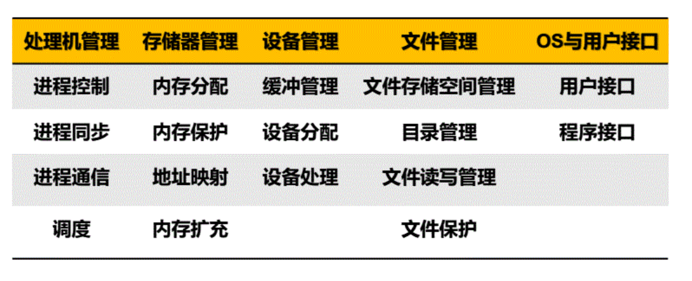

# MindSyncOS 系统信息

## 1. 系统功能介绍
<!--  -->
* 系统支持鼠标与键盘驱动，可以控制鼠标移动，键盘输入文字
* 系统支持多图层，图层可以设置上下层关系，可以打开多个窗口，且画面刷新经过优化，提高了画面刷新速度。
* 系统内存支持动态分区分配，使用首次适应算法。
* 系统支持多任务，提高并发性。多任务基于优先级算法，设置优先级后鼠标等图像响应速度提高。
### 1.1 处理机管理

#### 1.1.1 支持多任务
- 创建任务：task_


### 1.2 存储器管理

#### 1.2.1 系统内存分布图

| 地址                    | 作用                                                         | 大小   |
| ----------------------- | ------------------------------------------------------------ | ------ |
| 0x00000000 - 0x000fffff | 虽然在启动中会多次使用，但之后基本会清空（除了BIOS和vram等） | 1MB    |
| 0x00100000 - 0x00267fff | 用于保存软盘的内容                                           | 1440KB |
| 0x00268000 - 0x0026f7ff | 空                                                           | 30KB   |
| 0x0026f800 - 0x0026ffff | IDT                                                          | 2KB    |
| 0x00270000 - 0x0027ffff | GDT                                                          | 64KB   |
| 0x00280000 - 0x002fffff | bootpack.hrb                                                 | 512KB  |
| 0x00300000 - 0x003fffff | 栈及其他                                                     | 1MB    |
| 0x00400000 - ${end}     | 空                                                           |        |

#### 1.2.2 文件
- 文件信息
```c
struct FILEINFO {
    unsigned char name[8], ext[3], type;
    char reserve[10];
    unsigned short time, date, clustno;
    unsigned int size;
};
```

