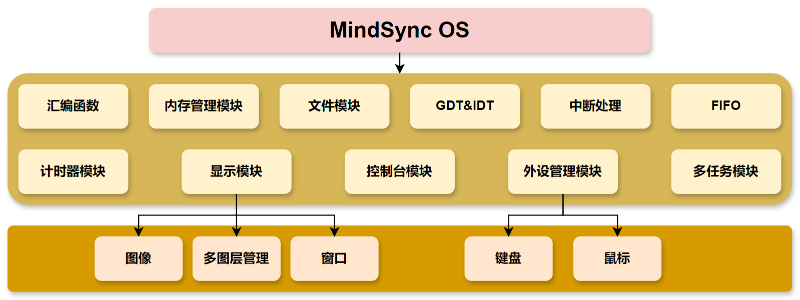

# MindSyncOS 系统信息

## 1. 系统功能介绍
```
* 系统支持鼠标与键盘驱动，可以控制鼠标移动，键盘输入文字
* 系统支持多图层，图层可以设置上下层关系，可以打开多个窗口，且画面刷新经过优化，提高了画面刷新速度。
* 系统内存支持动态分区分配，使用首次适应算法。
* 系统支持多任务，提高并发性。多任务基于优先级算法，设置优先级后鼠标等图像响应速度提高。
```

1. 处理机管理：
   1. 系统支持多任务并发运行，设置任务优先级，高优先级优先运行，同级任务按时间片轮转法调度。
   2. 系统支持绝大多数任务调度原语，能够将任务在创建、就绪、运行、阻塞、挂起、终止几个状态合理切换。
   3. 通过FIFO实现消息队列对任务进行控制，配合开关中断，支持任务的互斥与同步。
2. 存储器管理：
   1. 系统支持动态内存分配与释放，使用首次适应算法，且对内核与用户区域进行了设计与划分。
   2. 系统控制台支持使用 `mem`指令查看内存使用情况。
3. 设备管理：
   1. 系统支持键盘与鼠标控制，编写中断处理程序处理用户输入。
   2. 能够使用键盘输入文字，使用 `Tab`切换窗口，使用鼠标移动窗口。
4. 文件管理：
   1. 系统控制台支持使用 `dir`指令查看磁盘目录，使用 `type`指令查看文件内容。
   2. 支持检索并运行存储在系统硬盘的用户程序，系统内有一个示例程序 `hello.hrb`，可以输入 `hello`或 `hello.hrb`运行。
5. OS与用户接口：
   1. 系统具有可视界面，以窗口形式显示应用程序画面，支持多图层的叠加处理。
   2. 用户可以使用鼠标与系统交互。
   3. 用户可以使用键盘输入指令，并在屏幕现实的控制台查看回显。
   4. 用户可以使用系统提供的API进行编程，实现用户程序在控制台输出文字。

### 1.2 存储器管理

#### 1.2.1 系统内存分布图

| 地址                    | 作用                                                         | 大小   |
| ----------------------- | ------------------------------------------------------------ | ------ |
| 0x00000000 - 0x000fffff | 虽然在启动中会多次使用，但之后基本会清空（除了BIOS和vram等） | 1MB    |
| 0x00100000 - 0x00267fff | 用于保存软盘的内容                                           | 1440KB |
| 0x00268000 - 0x0026f7ff | 空                                                           | 30KB   |
| 0x0026f800 - 0x0026ffff | IDT                                                          | 2KB    |
| 0x00270000 - 0x0027ffff | GDT                                                          | 64KB   |
| 0x00280000 - 0x002fffff | bootpack.hrb                                                 | 512KB  |
| 0x00300000 - 0x003fffff | 栈及其他                                                     | 1MB    |
| 0x00400000 - ${end}     | 空                                                           |        |

#### 1.2.2 文件
- 文件信息
```c
struct FILEINFO {
    unsigned char name[8], ext[3], type;
    char reserve[10];
    unsigned short time, date, clustno;
    unsigned int size;
};
```
### 2.1 系统设计

#### 2.1.1 系统主进程


#### 2.1.2 其他模块


### 2.2 系统功能模块

